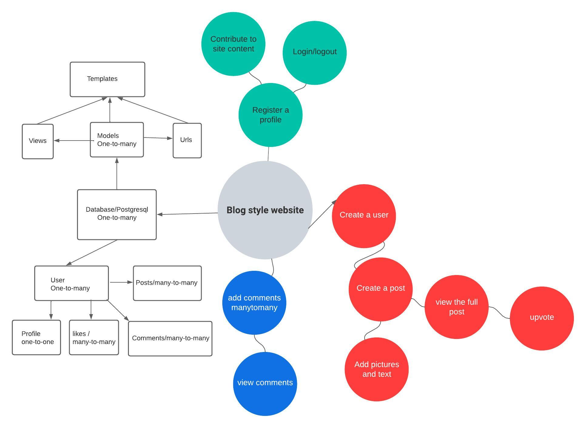
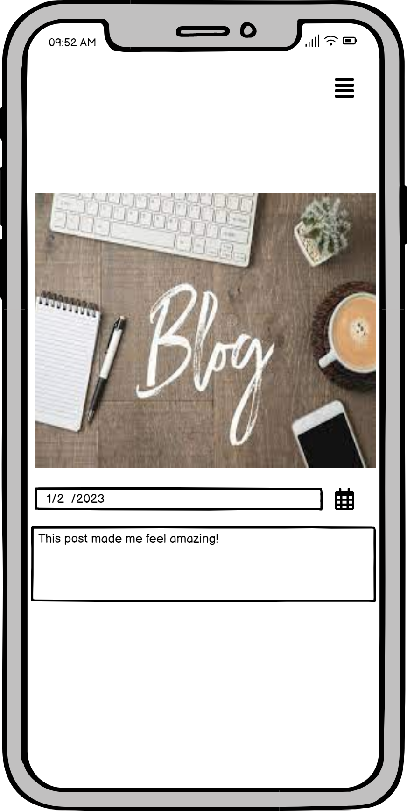
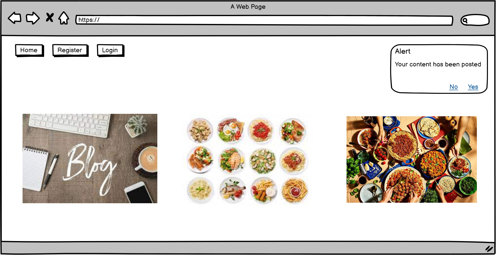

## Bluedit
This website is intended for people sharing their experiences with other users for inspiration and ideas or simply sharing their thoughts. The forum has a post section where you can add pictures with comments and add likes under each post.

# Agile development

## User stories
- As a user i want to be able to create a profile to access the website
- As a user i want to be able to view content that interests me
- As a user i want to upvote posts 
- As a user i want to be able to comment under posts to share my thoughts and opinions
- As a user i want to create posts that can include pictures and text

## User story implementation
- The registration has been done with the allauth library and customized
- Viewing posts has been implemented with django in a separate page to view the full post or in a feed format displayed on the front page
- Each post has a been split into the picture section, the post card section and the likes and datetime section. The user selects a picture to display on the top part of the card with the author of the posts name displayed at the bottom of the picture. The likes works as a toggle function where the user either clicks in to give a like or leave it to default which is not upvoted at all
- On each post the user has the ability to edit or delete content on the page to their own preference if they change their mind
- Under the post detail where the user views the full page they have an option of commenting on the created post. This function is restricted to users only

## Existing Features
- The user can create their own profile
- The navbar is displayed on top of the page without borders with a cleaner look for the user
- The website has a post section divided into three post per row and then it creates a new row below when viewed on a full screen
- When the user clicks on one specific post it displays on full screen rendering across the screen
- The user has the option to pick on a created page to either edit or delete the post entirely
- Under each post the user can see the date when the post was created and leave a like for the poster

## The Home Page 
- The home pages features are a navigation bar on the top left where the user can login and logout and register for an account
## Footer

# Testing

### HTML
- HTML checker has been used to validate each separate page for error
- base.html : The errors displayed in the html validator refers to the django functions such as  and says illegal characters "{" and the not allowed in href links
- index.html : 
- edit_post.html : The error are refering to python/django formats and says there are no doctype present in the file(which is injected from the base.html)
- post_detail.html : Under post detail it gives me the error from the inline css code saying that its expecting a digit but is given a percentage instead
### CSS
- W3C Jigsaw validator has been used to check the css file in this project: 
- The errors are concerning line 83 and 84 (-moz-transform and -webkit-transform) and says its not supported by all search engines
### Python

### Javascript

### Unfixed bugs
- The delete funtion is refering to a 404 status code 
### Further Testing
- Further testing has been done with pytest with the intention of checking if the user is logged in with the status code respone returning 200 which means there is a connection between the user and the application
### Planning 

## Deployment to Heroku
The application has been created on Heroku with the following steps:
- 
-
-
-
-
## Credits and sources
- CRUD funtionality https://www.geeksforgeeks.org/delete-view-function-based-views-django/?ref=lbp 
### Content

- The setup and the shell of the website has been taken from I think therefore i blog
- The ideas has been taken and implemented by hello django

### Media
- The pictures are taken from ...
- 

## Acknowledgements 
- My mentor for tremendous help and coaching
- The tutor team at Code Institute for help and feedback
