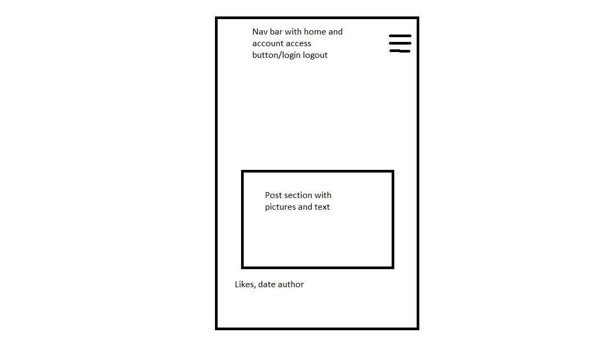

## Bluedit
This website is intended for people sharing their experiences with other users for inspiration and ideas or simply sharing their thoughts. The forum has a post section where you can add pictures with comments and add likes under each post.

## User stories
- As a user i want to be able to create a profile to access the website
- As a user i want to be able to view content that interests me
- As a user i want to upvote posts 
- As a user i want to be able to comment under posts to share my thoughts and opinions
- As a user i want to create posts that can include pictures and text

## User story implementation
- The registration has been done with the allauth library and customized
- 

## Existing Features
- The user can create their own profile that then makes the content viewable to the user
- The navbar is displayed on top of the page without borders with a cleaner look for the user
- The website has a post section divided into three post per row and then it creates a new row below
- When the user clicks on one specific post it displays on full screen with rendering across the screen
- T

## The Home Page 

## Admin Page

## Footer

## Testing

### HTML

### CSS

### Python

### Javascript

### Unfixed bugs

### Further Testing

### Planning 

%20H%20(659px).png)

## Deployment to Heroku
The application has been created on Heroku with the following steps:
- 
## Credits and sources
- CRUD funtionality https://www.geeksforgeeks.org/delete-view-function-based-views-django/?ref=lbp 
### Content

- The setup and the shell of the website has been taken from I think therefore i blog
- The ideas has been taken and implemented by hello django
- The pictures are taken from ...

### Media

- 

## Acknowledgements 
- My mentor for tremendous help and coaching
- The tutor team at Code Institute for help and feedback
